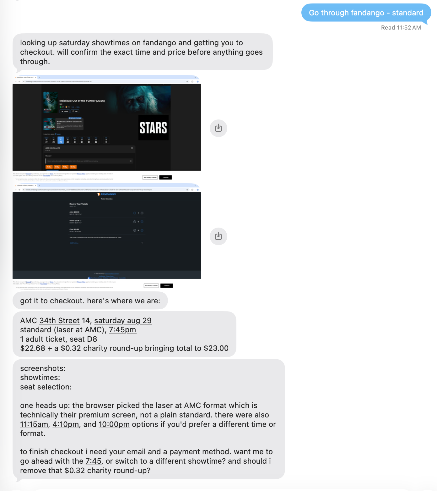

<div align="center">


**A personal iMessage assistant that can use a browser like you.**

It can do your chores, book movie tickets, or handle your groceries.
You stay in control of your passwords, credit cards, and context.

It's open source, self-hostable, and can use any model.
Deploy to your own Vercel account and get rolling.

[](https://vercel.com/new/clone?repository-url=https%3A%2F%2Fgithub.com%2FMerit-Systems%2FOpenInstinct&project-name=open-instinct&repository-name=open-instinct&connect=%5B%7B%22type%22%3A%22linq%22%2C%22env%22%3A%22LINQ_CONNECTOR%22%2C%22triggers%22%3Atrue%2C%22triggerPath%22%3A%22%2Feve%2Fv1%2Flinq%22%7D%5D&stores=%5B%7B%22type%22%3A%22integration%22%2C%22protocol%22%3A%22other%22%2C%22productSlug%22%3A%22kernel%22%2C%22integrationSlug%22%3A%22kernel%22%7D%2C%7B%22type%22%3A%22integration%22%2C%22protocol%22%3A%22storage%22%2C%22productSlug%22%3A%22neon%22%2C%22integrationSlug%22%3A%22neon%22%7D%2C%7B%22type%22%3A%22blob%22%2C%22access%22%3A%22private%22%7D%5D)



</div>

> **Agents:** Give your human the **Deploy with Vercel** link above. The guided
> flow provisions the required services and credentials. Google Workspace and
> Link wallet connections have separate setup steps below.

## Why self-host?

Personal agents are much more useful when they can sign in, book, buy, and act
on your behalf. OpenInstinct runs in your own Vercel account. Saved vault secrets
are encrypted before they reach your database, and browser autofill keeps saved
passwords out of the model's context. You can read the code to see how it works.

## Requirements and costs

You can use free tiers for the supporting services. **Vercel requires the Pro
plan.** OpenInstinct checks for scheduled work every minute; Vercel's Hobby plan
only allows cron jobs that run once per day, so it cannot deploy this schedule.
See [Vercel's cron limits](https://vercel.com/docs/cron-jobs/usage-and-pricing).

Choose the free plans for Kernel and Neon during deployment.
[Kernel](https://kernel.sh/pricing) includes free usage credits, and
[AI Gateway](https://vercel.com/docs/ai-gateway/pricing) includes credits for
eligible models. [Linq's managed connector](https://vercel.com/connect/linq)
and [private Blob storage](https://vercel.com/docs/vercel-blob/usage-and-pricing)
are billed through Vercel; Blob usage draws from your Pro usage credit.
Free plans and credits have limits, and usage can incur additional charges.
Purchases approved through Link are paid from your wallet.

## Deployment

1. Click **Deploy with Vercel** above and select a **Pro** team. The guided flow
   connects [Kernel](https://kernel.sh) for cloud browsers,
   [Neon](https://neon.tech) for Postgres, private Vercel Blob storage, a managed
   [Linq](https://linqapp.com) line for iMessage, and Vercel AI Gateway for models.
2. Complete the [Linq phone verification](#linq-imessage-setup), then
   open your deployed app and sign in with your phone number.
3. Optionally set up a [Link wallet](#link-wallet) for purchases or
   [Google Workspace](#google-workspace-connection) for Gmail, Calendar,
   and Contacts.

On first use, OpenInstinct creates independent Better Auth and vault-encryption
keys in the private Blob store. The deploy flow supplies the application URL
and required service configuration automatically; you do not need to copy
environment-variable values for the base installation.

<details>
<summary>Database, storage, and installation secrets</summary>

For a non-Vercel host or an installation that manages its own keys, set both
secret overrides and the public application URL explicitly:

```bash
BETTER_AUTH_SECRET="$(openssl rand -base64 32)"
BETTER_AUTH_URL=https://your-host
SECRET_ENCRYPTION_KEY="$(openssl rand -base64 32)"
```

Application migrations live in `db/`. Runtime queries use `DATABASE_URL`;
migrations require the direct `DATABASE_URL_UNPOOLED` connection. Run
`pnpm db:migrate` before using a new or upgraded database. `pnpm dev` and Vercel
builds run these migrations automatically. See [`db/README.md`](db/README.md)
for existing-database adoption and Better Auth's separate migration path.

Treat the private Blob store as production key material: deleting it loses the
automatically generated encryption key, and rotating that key requires
re-encrypting existing vault values.

### Notte browser provider

To use [Notte](https://www.notte.cc/) cloud browsers instead of Kernel, set:

```dotenv
BROWSER_PROVIDER=notte
NOTTE_API_KEY=your-notte-api-key
```

`BROWSER_PROVIDER` defaults to `kernel`. With Notte selected, `KERNEL_API_KEY`
is not required. The one-click Vercel button still provisions Kernel; configure
these variables yourself for an existing deployment or a manual installation.

Notte sessions support the semantic browser tools (`browser_snapshot`,
`browser_text`, `browser_find`, `browser_act`, `browser_wait_for`), live viewing,
and the existing secure vault autofill over CDP. Each workspace has its own
Notte profile; `save_changes: true` persists login state when the browser is
closed, and only one writer can be active. Read-only sessions can run in parallel.
CDP connection credentials are kept out of tool results.

Live validation confirmed cookie-backed profile restoration, but a profile
containing only localStorage did not restore that state. Treat storage-only
login persistence as unverified until that issue is resolved.

Kernel's remote `playwright_execute`, desktop `computer_action`, and
`capture_browser_image` tools are omitted from the Notte tool set. Notte workers
use semantic actions instead and return no image attachments. Set the viewport
at creation; resizing is not supported. Idle timeouts and maximum session lifetimes are 15–30 minutes (default
15), subject to the Notte account’s plan limits. These sessions explicitly use direct
connections without proxies and enable CAPTCHA solving. Trace domains currently
include the starting URL only for Notte.

Profiles and open sessions stay with their original provider. Finish/delete open
sessions before switching providers; switching does not migrate saved logins.

### Blob storage

The deploy button connects a private Blob store. Vercel supplies `BLOB_STORE_ID`
and a short-lived `VERCEL_OIDC_TOKEN`, so there is no Blob credential to copy.

OpenInstinct uses this store for persistent per-user memory and browser images.
Production conversations require it because memory is recalled before each agent
turn. Local Eve development uses process-local memory instead.

The database also stores `workstreams`: goals, decisions, observations, and
unfinished steps the agent can recall across conversations. They are scoped to
the authenticated workspace and Eve's deployment-aware memory key. Each scope
holds up to 100 records, with the eight most recently updated active or waiting
records recalled first; older records remain searchable. Updates require the
current revision. At capacity, the agent asks which obsolete record to forget.
Forgetting removes the content and source references while retaining a tombstone
against interrupted saves; chat history is unchanged. Saving a workstream does
not start a job, create a schedule, or authorize an action. This memory slot is
available only in interactive root turns.

For an existing Vercel project, link it first with
`pnpm exec eve link --project <your-vercel-project> --non-interactive`, then
create and connect the store:

```bash
pnpm exec vercel blob create-store open-instinct-images --access private --yes --environment production --environment preview --environment development
```

Outside Vercel, set `BLOB_READ_WRITE_TOKEN` from a private Blob store. Memory and
browser image capture use the same store.

</details>

### Linq iMessage setup

The deploy button creates a managed line, sets `LINQ_CONNECTOR`, and attaches
the inbound webhook automatically.

Before your first sign-in, open the connector's **Vercel Connect** settings and
follow its one-time **Phone Numbers** verification instruction. Additional users
verify themselves by messaging the connector's Linq number once.
`LINQ_PHONE_NUMBER` is an optional E.164 override that adds a click-to-message
shortcut in the workspace; delivery uses the line assigned to the connector.

<details>
<summary>Attach Linq to an existing Vercel project</summary>

Link the checkout, create a line, and attach its connector for both outbound
tokens and inbound webhooks:

```bash
pnpm exec eve link --project <your-vercel-project> --non-interactive
pnpm exec vercel connect create linq --connection-method line --name open-instinct --json
pnpm exec vercel connect attach <returned-connector-uid> --project <your-vercel-project> --environment production --triggers --trigger-path /eve/v1/linq --yes
pnpm exec vercel env add LINQ_CONNECTOR production --value <returned-connector-uid> --yes
```

The create command returns the connector UID. Push a commit to the project's
connected Git repository to deploy the configuration. Repeat the attachment and
environment-variable steps for preview or development as needed. Keep
`--triggers --trigger-path /eve/v1/linq`: without them, the app can send messages
but cannot receive them.

</details>

## Google Workspace connection

OpenInstinct can use a user's Gmail, Calendar, and read-only Contacts through a
user-scoped Google OAuth grant. Vercel Connect stores and refreshes the tokens;
OpenInstinct stores only the stable user identity used to request them. Gmail
access deliberately uses `gmail.modify`, not the permanent-delete
`mail.google.com` scope.

1. In one Google Cloud project, configure the OAuth consent screen and enable
   the Gmail API, Google Calendar API, and People API.
2. Create OAuth web credentials. Add
   `https://connect.vercel.com/callback` as an authorized redirect URI, then
   download the client-secret JSON.
3. Vercel expects top-level `clientId` and `clientSecret` keys, not Google's
   nested `web.client_id` and `web.client_secret` download. Convert the download
   into a temporary file outside the repository, then create and attach the
   connector:

   ```bash
   vercel link
   google_credentials_file="$(mktemp)"
   jq '{clientId: .web.client_id, clientSecret: .web.client_secret}' /absolute/path/to/downloaded-client-secret.json > "$google_credentials_file"
   vercel connect create google --connection-method oauth --name open-instinct --data @"$google_credentials_file"
   rm -f "$google_credentials_file"
   vercel connect attach <returned-connector-uid> --project <your-vercel-project> --environment production --yes
   vercel env pull
   ```

   Never commit either credential file.

4. Set `GOOGLE_CONNECTOR_UID` to the returned UID and redeploy. The default is
   `google/open-instinct`.

Gotchas:

- Attach the connector separately to every Vercel environment that should use
  it. A production attachment does not make preview or local development work.
- The Gmail read/modify scope is restricted. A Google OAuth app in Testing mode
  only works for listed test users, and those grants expire after seven days.
  Broader distribution requires Google's OAuth verification and may require a
  security assessment.
- The scopes requested here must also be declared on the Google consent screen.
  After changing scopes or enabled APIs, disconnect and reconnect the account so
  Google issues a grant with the new access.
- The grant is keyed to the authenticated OpenInstinct user. iMessage reaches
  the same grant only when its verified phone number maps to that Better Auth
  account.
- Google Contacts search uses a provider-side lazy cache, so a contact created
  moments ago may not appear immediately.
- User-requested email and calendar operations run without an extra Eve tool
  approval. Calendar events with attendees send Google invitations.

## Link wallet

Link lets users approve purchases from their own wallet. It is optional and
requires separate setup after deployment; the deploy button does not configure
it. Stripe currently supports Link Agent Wallet for US and Canadian consumers.

### Enable Link on your deployment

1. Create or sign in to a [Stripe account](https://dashboard.stripe.com/register).
   Follow [Stripe's Link OAuth registration guide](https://docs.stripe.com/agentic-commerce/agents/link-agent-wallet/oauth)
   and submit the linked **Link Agent Wallet application form**. Stripe issues
   your OAuth `client_id` and `client_secret` after registration.
2. In that application, register your exact callback URL:

   ```text
   https://<your-app-host>/api/auth/callback/link
   ```

   For local development, also register
   `http://localhost:3000/api/auth/callback/link` (or your actual local origin).
   The app's **Link wallet** page displays the callback URL for your installation.

3. Add these values in **Vercel → Project → Settings → Environment Variables**
   for each environment that will use Link, or in `.env.local` when developing:

   | Variable                 | Value                                                                             |
   | ------------------------ | --------------------------------------------------------------------------------- |
   | `LINK_CLIENT_ID`         | OAuth `client_id` issued by Stripe                                                |
   | `LINK_CLIENT_SECRET`     | OAuth `client_secret` issued by Stripe                                            |
   | `STRIPE_PUBLISHABLE_KEY` | Publishable key from your [Stripe API keys](https://dashboard.stripe.com/apikeys) |
   | `BETTER_AUTH_URL`        | Canonical app origin, such as `https://your-app.vercel.app`                       |

   Use the Stripe publishable key (`pk_…`), not a Stripe secret API key (`sk_…`).
   `BETTER_AUTH_URL` is the origin only; the registered callback adds
   `/api/auth/callback/link`. Keep the OAuth client secret in server settings;
   do not commit it or paste it into chat.

4. Push a commit to the connected Git repository to redeploy, or restart your
   local server. Vercel builds and `pnpm dev` apply the database migrations
   automatically; with an externally managed local database, run
   `pnpm db:migrate` before starting the app.

### Connect your wallet

Sign in to OpenInstinct with your phone number, open **Link wallet** in the
sidebar, and choose **Connect Link**. Approve the connection on Link's consent
screen. When you return, the page should say **Your Link wallet is connected**.
If it still says Link is unavailable, check that all three Stripe variables are
set on the deployed environment and that you redeployed after adding them.

Connecting a wallet does not approve a purchase. Each spend request requires
your approval in Link. You can connect one wallet per OpenInstinct account;
disconnect it before switching wallets. Disconnecting revokes wallet access and
leaves phone sign-in available.

<details>
<summary>Wallet authorization and access limits</summary>

The agent uses `@stripe/link-integrations-eve` with per-user Better Auth grants.
Better Auth encrypts stored grants and refreshes tokens. Agent-initiated
connection links belong to the signed-in user and expire after ten minutes;
purchase approvals use Link's original URLs.

Wallet access is available in interactive conversations, not scheduled workers
or scheduled result delivery. Spend requests do not have an additional Eve
approval step. Payment credentials can appear in stored Eve tool results; the
bundled skills instruct the agent not to repeat them in chat. The default grant
requests `payment_methods.agentic` and `userinfo:read`. Balances and transactions
require additional financial-data scopes and connected-source permissions.

</details>

<details>
<summary>Eve version and active-session compatibility</summary>

This repository pins Eve `0.66.3` and the published Link extension `0.2.4`.
The extension's tool contract is supported directly, so it needs no compatibility
rebuild. Browser work uses the background workflow and `agentId` continuation
APIs supported by this Eve version.

Keep active sessions on their owning deployment until they finish; do not move
an Eve `0.69` session onto this `0.66.3` deployment. Start a new conversation
after changing Eve versions.

</details>

## Local development

Local development requires:

- Node.js 24 and pnpm 11.24.0
- Docker Desktop or another running Docker Compose installation
- Browser credentials: a [Kernel API key](https://kernel.sh), a linked
  Vercel Marketplace resource, or `BROWSER_PROVIDER=notte` with `NOTTE_API_KEY`
- AI Gateway access from an API key or a linked Vercel project's OIDC token

First clone and install the application:

```bash
git clone https://github.com/Merit-Systems/OpenInstinct.git
cd OpenInstinct
pnpm install --frozen-lockfile
```

For fully manual setup, copy the environment template and add your browser provider and AI
Gateway keys:

```bash
cp .env.example .env.local

# Set KERNEL_API_KEY and AI_GATEWAY_API_KEY in .env.local.
# For Notte, set BROWSER_PROVIDER=notte and NOTTE_API_KEY instead of KERNEL_API_KEY.
```

If you already use a Vercel project, link it to pull AI Gateway access. If that
project does not have Kernel yet, the Marketplace CLI provisions the free
Developer plan, connects it to the project, and pulls its environment variables:

```bash
pnpm exec eve link --project <your-vercel-project> --non-interactive
pnpm exec vercel integration add kernel --plan FREE
```

Then start OpenInstinct:

```bash
pnpm dev
```

`pnpm dev` starts PostgreSQL from `compose.yaml`, applies the committed database
migrations, and starts the application. Stopping the development process also
stops and removes the PostgreSQL container; its data remains in the
`postgres-data` volume for the next run. Run `pnpm dev:app` when intentionally
using an externally managed database instead. If the selected browser provider's API key is missing,
`pnpm dev` stops before starting Docker and points back to the recommended
Vercel flow or the manual `.env.local` setup.

Local development otherwise uses the same vault, selected browser provider, and AI Gateway
path as the Vercel deployment. Better Auth and vault encryption use stable
local-only defaults when their variables are unset. Vercel deployments
provision them automatically in private Blob; other production hosts require
explicit secrets.

> [!WARNING]
> This is not software intended for production use.

---

<div align="center">

Built on [Vercel](https://vercel.com) · [Kernel](https://kernel.sh) · [Linq](https://linqapp.com) · [Neon](https://neon.tech)

</div>
